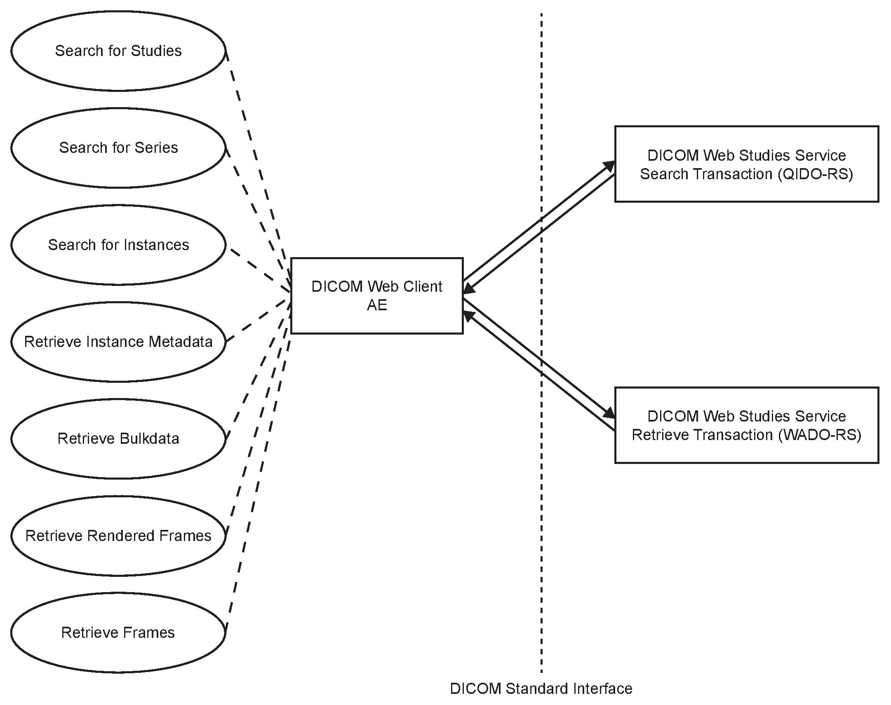
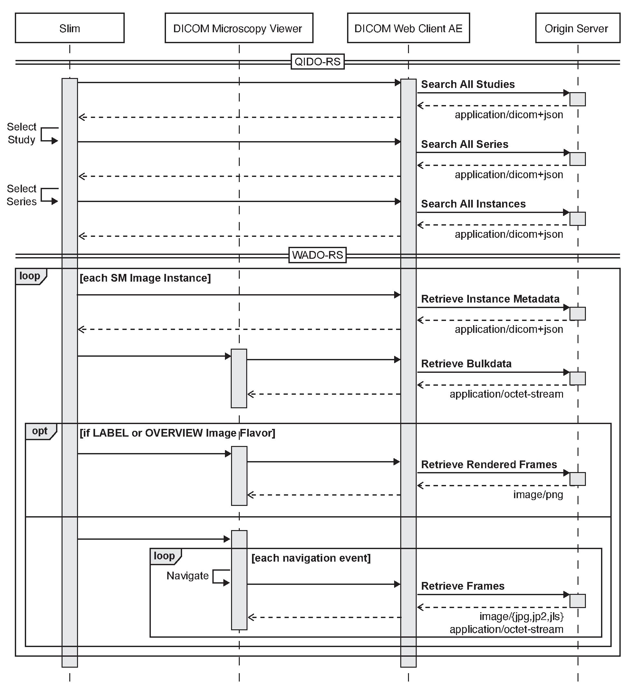

---
author:
- MGH Pathology
date: June 6, 2023
title: Slim v0.14.0
---

# Conformance Statement Overview
*Slim* is a dynamic single-page application that allows users to interactively display DICOM VL Whole Slide Microscopy Image instances in a web browser.

*Slim* relies on the JavaScript *dicom-microscopy-viewer* library to display digital images and related information to the user.
*Slim*, as well as the *dicom-microscopy-viewer*, internally use the JavaScript *dicomweb-client* library to programmatically search for and retrieve data from a PACS using the Search and Retrieve transactions of the DICOM Web Studies Service, respectively.

## DICOM Web Services
| Service    | User of Service (User Agent) | Provider of Service (Origin Server) |
| - | - | - |
| Studies Service - Retrieve transaction (WADO-RS)  |  Yes  | No |
| Studies Service - Search transaction (QIDO-RS)    |  Yes  | No |

# Introduction

## Revision History
| Document Version | Revision Date |  Revision Author    |  
| ---------------- | ------------- |  ------------------ |
|    v0.14.0       |   June, 2023    |  Chris Gorman       |
|    v0.11.2       |  October, 2022  | Markus D. Herrmann  |

## Audience
This document is written for the people that need to understand how *Slim* will integrate into their healthcare facility.
This includes both those responsible for overall imaging network policy and architecture, as well as integrators who need to have a detailed understanding of the DICOM features of the product.
This document contains some basic DICOM definitions so that any reader may understand how this product implements DICOM features.
However, integrators are expected to fully understand all the DICOM terminology, how the tables in this document relate to the product's functionality, and how that functionality integrates with other devices that support compatible DICOM features.

## Remarks
The scope of this DICOM Conformance Statement is to facilitate integration between *Slim* and other DICOM products.
The Conformance Statement should be read and understood in conjunction with the DICOM Standard.
DICOM by itself does not guarantee interoperability.
The Conformance Statement does, however, facilitate a first-level comparison for interoperability between different applications supporting compatible DICOM functionality.

This Conformance Statement is not supposed to replace validation with other DICOM equipment to ensure proper exchange of intended information.
In fact, the user should be aware of the following important issues:

-   The comparison of different Conformance Statements is just the first step towards assessing interconnectivity and interoperability between the product and other DICOM conformant equipment.

-   Test procedures should be defined and executed to validate the required level of interoperability with specific compatible DICOM equipment, as established by the healthcare facility.

## Terms and Definitions
Informal definitions are provided for the following terms used in this Conformance Statement.
The DICOM Standard is the authoritative source for formal definitions of these terms.

<dl>
<dt>Abstract Syntax</dt>
<dd>The information agreed to be exchanged between applications, generally equivalent to a Service/Object Pair (SOP) Class. Examples: Verification SOP Class, Modality Worklist Information Model Find SOP Class, Computed Radiography Image Storage SOP Class.</dd>

<dt>Application Entity (AE)</dt>
<dd>An end point of a DICOM information exchange, including the DICOM network or media interface software; i.e., the software that sends or receives DICOM information objects or messages. A single device may have multiple Application Entities.</dd>

<dt>Application Entity Title (AET)</dt>
<dd>The externally known name of an Application Entity, used to identify a DICOM application to other DICOM applications on the network.</dd>

<dt>Application Context</dt>
<dd>The specification of the type of communication used between Application Entities. Example: DICOM network protocol.</dd>

<dt>Association</dt>
<dd>A network communication channel set up between Application Entities.</dd>

<dt>Attribute</dt>
<dd>A unit of information in an object definition; a data element identified by a tag. The information may be a complex data structure (Sequence), itself composed of lower level data elements. Examples: Patient ID (0010,0020), Accession Number (0008,0050), Photometric Interpretation (0028,0004), Procedure Code Sequence (0008,1032).</dd>

<dt>Information Object Definition (IOD)</dt>
<dd>The specified set of Attributes that comprise a type of data object; does not represent a specific instance of the data object, but rather a class of similar data objects that have the same properties. The Attributes may be specified as Mandatory (Type 1), Required but possibly unknown (Type 2), or Optional (Type 3), and there may be conditions associated with the use of an Attribute (Types 1C and 2C). Examples: MR Image IOD, CT Image IOD, Print Job IOD.</dd>

<dt>Joint Photographic Experts Group (JPEG)</dt>
<dd>A set of standardized image compression techniques, available for use by DICOM applications.</dd>

<dt>Media Application Profile</dt>
<dd>The specification of DICOM information objects and encoding exchanged on removable media (e.g., CDs).</dd>

<dt>Module</dt>
<dd>A set of Attributes within an Information Object Definition that are logically related to each other. Example: Patient Module includes Patient Name, Patient ID, Patient Birth Date, and Patient Sex.</dd>

<dt>Negotiation</dt>
<dd>First phase of Association establishment that allows Application Entities to agree on the types of data to be exchanged and how that data will be encoded.</dd>

<dt>Presentation Context</dt>
<dd>The set of DICOM network services used over an Association, as negotiated between Application Entities; includes Abstract Syntaxes and Transfer Syntaxes.</dd>

<dt>Protocol Data Unit (PDU)</dt>
<dd>A packet (piece) of a DICOM message sent across the network. Devices must specify the maximum size packet they can receive for DICOM messages.</dd>

<dt>Security Profile</dt>
<dd>A set of mechanisms, such as encryption, user authentication, or digital signatures, used by an Application Entity to ensure confidentiality, integrity, and/or availability of exchanged DICOMdata.</dd>

<dt>Service Class Provider (SCP)</dt>
<dd>Role of an Application Entity that provides a DICOM network service; typically, a server that performs operations requested by another Application Entity (Service Class User). Examples: Picture Archiving and Communication System (image storage SCP, and image query/retrieve SCP), Radiology Information System (modality worklist SCP).</dd>

<dt>Service Class User (SCU)</dt>
<dd>Role of an Application Entity that uses a DICOM network service; typically, a client. Examples: imaging modality (image storage SCU, and modality worklist SCU), imaging workstation (image query/retrieve SCU).</dd>

<dt>Service/Object Pair Class (SOP Class)</dt>
<dd>The specification of the network or media transfer (service) of a particular type of data (object); the fundamental unit of DICOM interoperability specification. Examples: Ultrasound Image Storage Service, Basic Grayscale Print Management.</dd>

<dt>Service/Object Pair Instance (SOP Instance)</dt>
<dd>An information object; a specific occurrence of information exchanged in a SOP Class. Examples: a specific x-ray image.</dd>

<dt>Tag</dt>
<dd>A 32-bit identifier for a data element, represented as a pair of four digit hexadecimal numbers, the "group" and the "element". If the "group" number is odd, the tag is for a private(manufacturer-specific) data element. Examples: (0010,0020) [Patient ID], (07FE,0010) [Pixel Data], (0019,0210) [privatedata element].</dd>

<dt>Transfer Syntax</dt>
<dd>The encoding used for exchange of DICOM information objects and messages. Examples: JPEG compressed (images), little endian explicit value representation.</dd>

<dt>Unique Identifier (UID)</dt>
<dd>A globally unique "dotted decimal" string that identifies a specific object or a class of objects; an ISO-8824 Object Identifier. Examples: Study Instance UID, SOP Class UID, SOP Instance UID.</dd>

<dt>Value Representation (VR)</dt>
<dd>The format type of an individual DICOM data element, such as text, an integer, a person's name, or a code. DICOM information objects can be transmitted with either explicit identification of the type of each data element (Explicit VR), or without explicit identification (Implicit VR); with Implicit VR, the receiving application must use a DICOM data dictionary to look up the format of each data element.</dd>
</dl>

## Basics of DICOM Communication
This section describes terminology used in this Conformance Statement for the non-specialist.
The key terms used in the Conformance Statement are highlighted in italics below.
This section is not a substitute for training about DICOM, and it makes many simplifications about the meanings of DICOM terms.

Two *Application Entities* (devices) that want to communicate with each other over a network using DICOM protocol must first agree on several things during an initial network "handshake".
One of the two devices must initiate an *Association* (a connection to the other device), and ask if specific services, information, and encoding can be supported by the other device (*Negotiation*).

DICOM specifies a number of network services and types of information objects, each of which is called an *Abstract Syntax* for the Negotiation.
DICOM also specifies a variety of methods for encoding data, denoted *Transfer Syntaxes*.
The Negotiation allows the initiating Application Entity to propose combinations of Abstract Syntax and Transfer Syntax to be used on the Association; these combinations are called *Presentation Contexts*.
The receiving Application Entity accepts the Presentation Contexts it supports.

For each Presentation Context, the Association Negotiation also allows the devices to agree on *Roles* --- which one is the *Service Class User* (SCU --- client) and which is the *Service Class Provider* (SCP --- server).
Normally the device initiating the connection is the SCU, i.e., the client system calls the server, but not always.

The Association Negotiation finally enables exchange of maximum network packet (*PDU*) size, security information, and network service options (called *Extended Negotiation* information).

The Application Entities, having negotiated the Association parameters, may now commence exchanging data.
Common data exchanges include queries for worklists and lists of stored images, transfer of image objects and analyses (structured reports), and sending images to film printers.
Each exchangeable unit of data is formatted by the sender in accordance with the appropriate *Information Object Definition*, and sent using the negotiated Transfer Syntax.
There is a Default Transfer Syntax that all systems must accept, but it may not be the most efficient for some use cases.
Each transfer is explicitly acknowledged by the receiver with a *Response Status* indicating success, failure, or that query or retrieve operations are still in process.

## References
-   NEMA PS3 Digital Imaging and Communications in Medicine (DICOM) Standard, available free at http://medical.nema.org/
-   Slim application source code and documentation, available free and open source at https://github.com/ImagingDataCommons/slim/
-   DICOM Microscopy Viewer library source code and documentation, available free and open source at
    https://github.com/ImagingDataCommons/dicom-microscopy-viewer/
-   DICOM Web Client library source code and documentation, available free and open source at <https://github.com/dcmjs-org/dicomweb-client/>

# Networking

## Implementation Model

### Application Data Flow

### Functional Definition of AEs

#### Functional Definition of "DICOM Web Client"

The *dicomweb-client* library is a HTTP client library that provides an API to query, retrieve, and store RESTful resources using the DICOM Web Studies Service. The *Slim* application uses this library internally for handling DICOM Web Studies Service requests over HTTP.

### Sequencing of Real World Activities

- The *Slim* application searches for studies that contain images of modality "SM" using QIDO-RS (query parameter "ModalitiesInStudy") and displays the list of matched study resources to the user.

- When the user selects a study, *Slim* searches for series that contain images of modality "SM" and that belong to selected study using QIDO-RS (query parameters "Modality" and "StudyInstanceUID") and displays the list of matched series resources to the user. In addition, *Slim* retrieves the metadata and rendered frames of the `OVERVIEW` image of the series (if available) using WADO-RS and displays it to the user along with relevant metadata.

- When the user selects a series, *Slim* retrieves instance metadata for VL Whole Slide Microscopy Image instances that belong to the selected series using WADO-RS and interprets the metadata to determine the image pyramid structure. *Slim* further retrieves the ICC Profile for each `VOLUME` image to allow for subsequent color correction of image frames. In addition, *Slim* retrieves the rendered frames of the `LABEL` image and the frames of the lowest resolution `VOLUME` (or `THUMBNAIL`) image of the selected series using WADO-RS and displays the images to the user. *Slim* also displays relevant metadata about the specimen that is the imaging target and the equipment that acquired the images.

- When the user navigates through the multi-resolution image pyramid (e.g., via pan or zoom events), *Slim* automatically retrieves frames of the `VOLUME` image of the selected series using WADO-RS for the current slide coordinate position, decodes the frames using the appropriate codec, transforms the decoded frames using the corresponding ICC profile, and displays the transformed frames to the user.

## AE Specifications

### "DICOM Web Client"

The *DICOM Web Client* is a user agent for DICOM Web Services.
It supports the Search, Retrieve, and Store transactions of the Studies Service.

#### Restful Services Specifications

##### Retrieve Transaction of the Studies Service (WADO-RS)
-   Study
-   Study Metadata
-   Study Bulkdata
-   Series
-   Series Metadata
-   Series Bulkdata
-   Rendered Series
-   Instance
-   Instance Metadata
-   Instance Bulkdata
-   Rendered Instance
-   Frames
-   Rendered Frames
-   Bulkdata

##### Search Transaction of the Studies Service (QIDO-RS)
-   All Studies
-   Study
-   Study's Series
-   Study's Instances
-   All Series
-   Series
-   Series' Instances
-   All Instances
-   Instance

##### Store transaction of the Studies Service (QIDO-RS)
-   All Studies
-   Study
