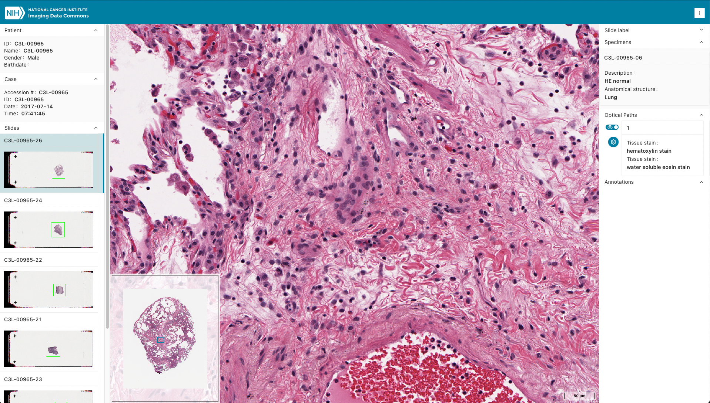
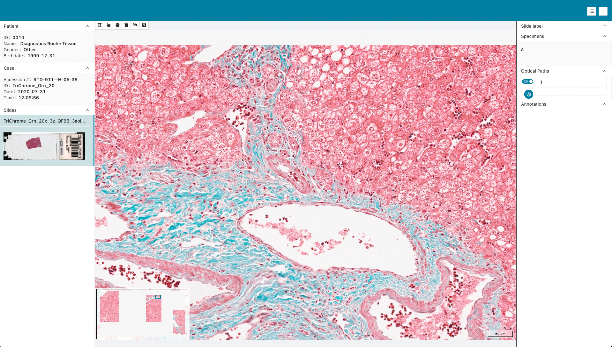
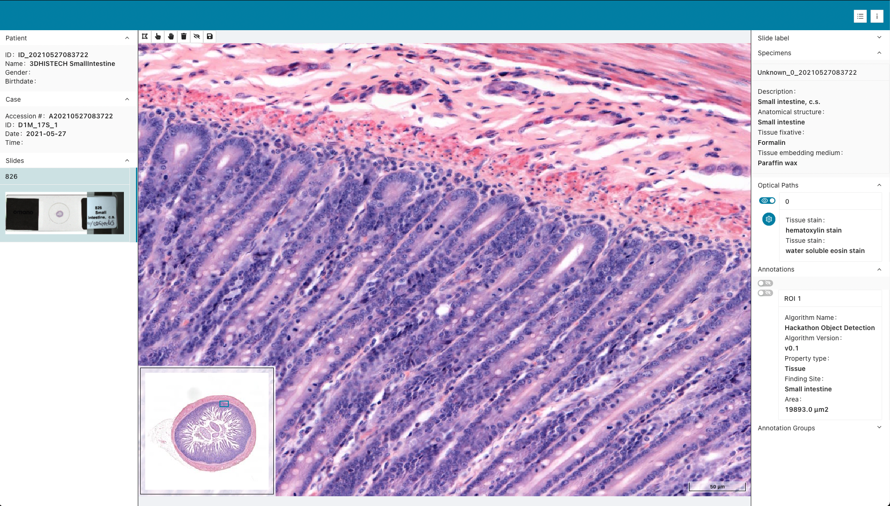
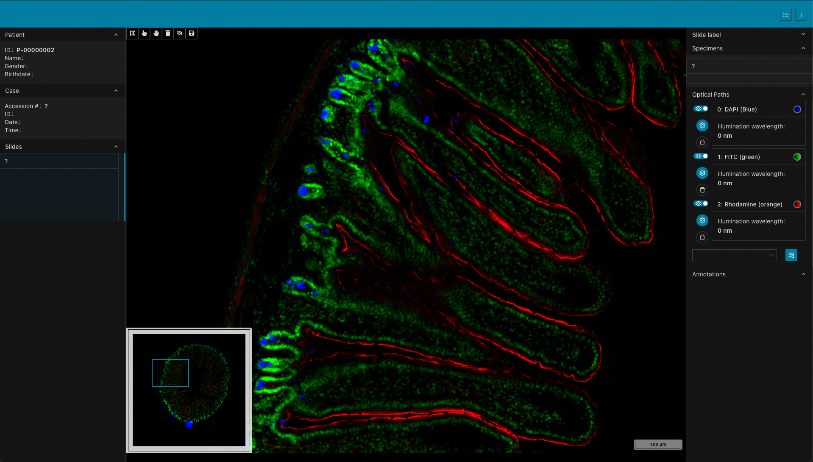
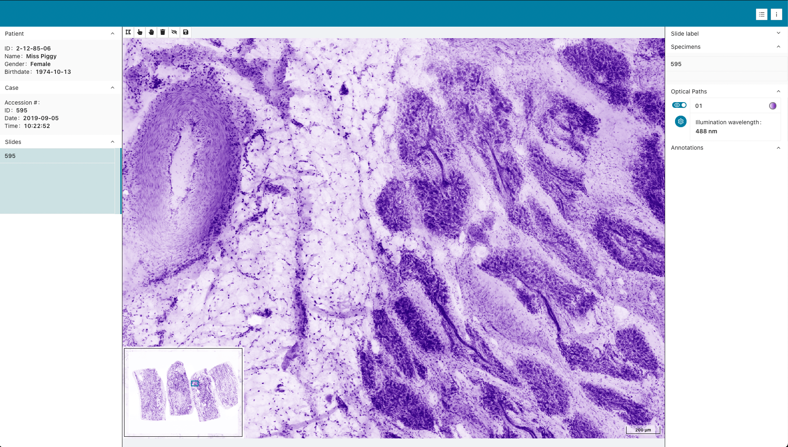
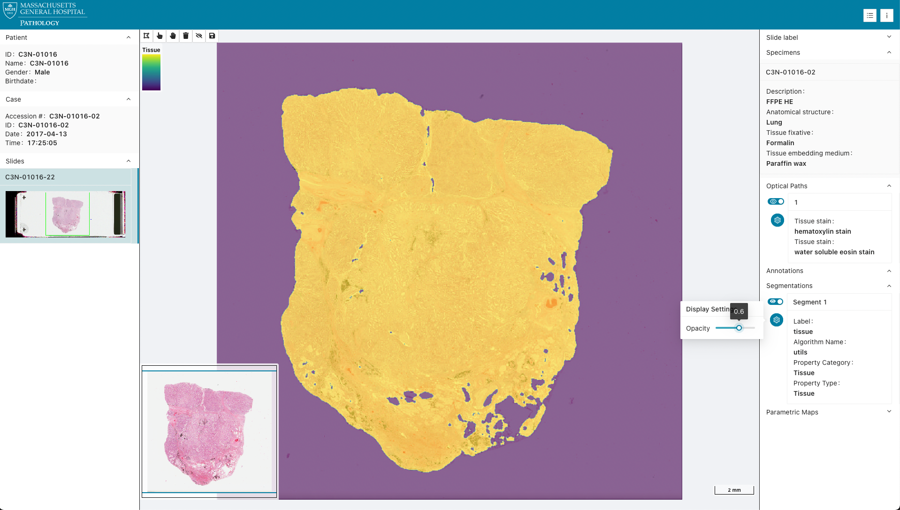
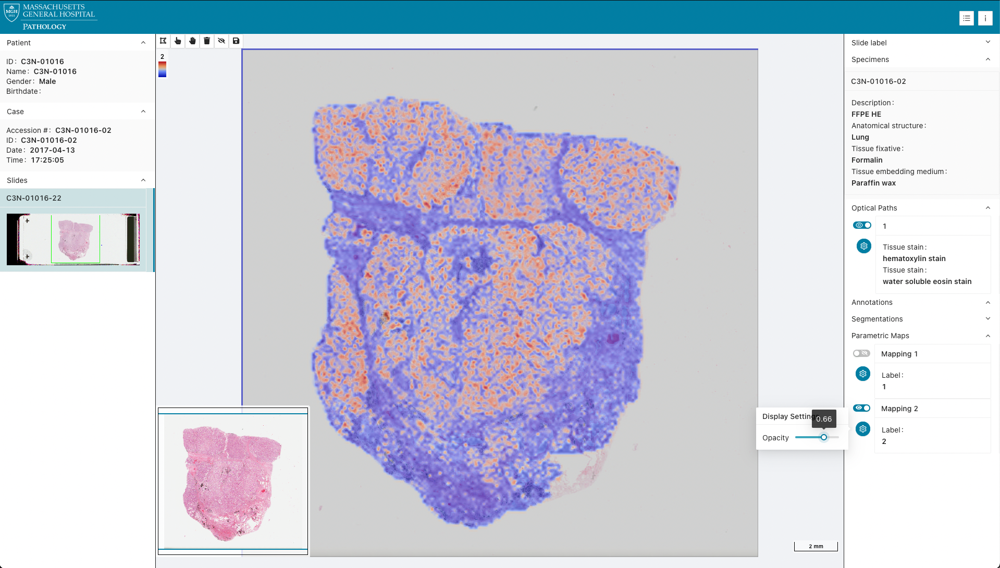
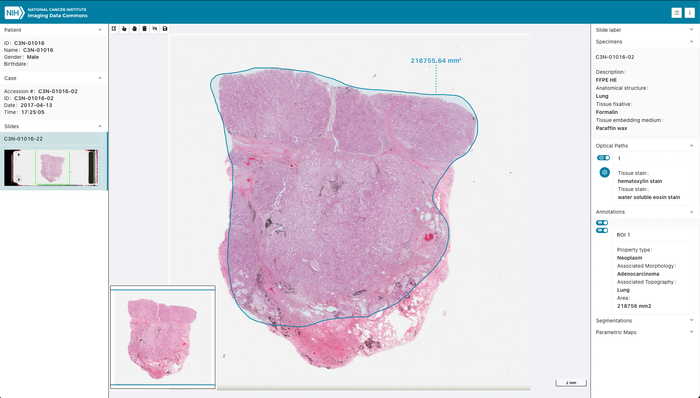
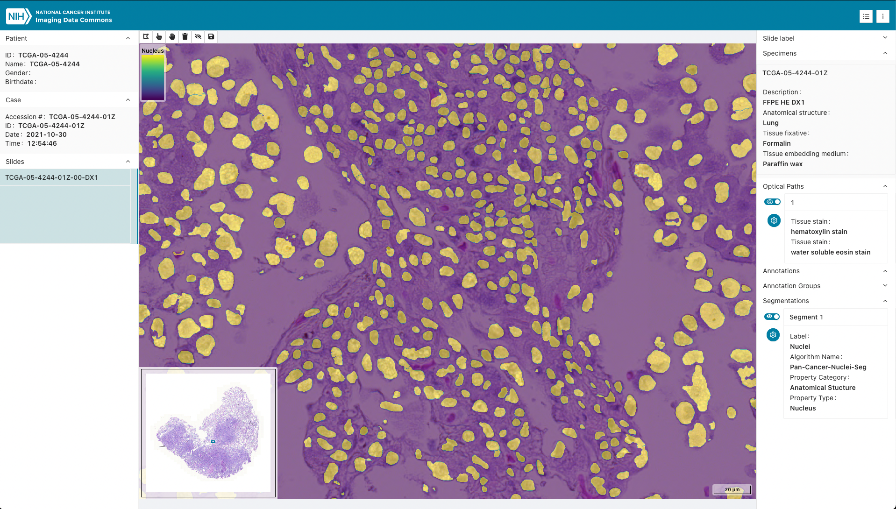
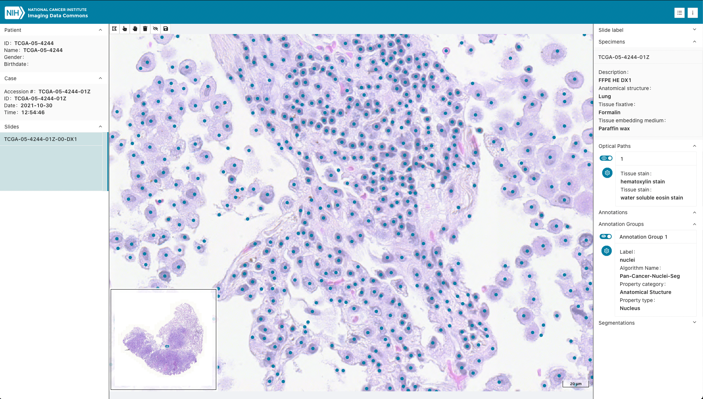

[](https://zenodo.org/badge/latestdoi/335130719)
[](https://github.com/imagingdatacommons/slim/actions)
[](https://opensource.org/licenses/Apache-2.0)

# Slim

**Interoperable slide microscopy viewer and annotation tool for imaging data science and computational pathology**

_Slim_ is a single-page application for interactive visualization and annotation of digital whole slide microscopy images and derived image analysis results in standard DICOM format.

The application is based on the [dicom-microscopy-viewer](https://github.com/ImagingDataCommons/dicom-microscopy-viewer) JavaScript library and runs fully client-side without any custom server components. It relies on [DICOMweb](https://www.dicomstandard.org/dicomweb/) RESTful services to search for, retrieve, and store imaging data, and can therefore be placed in front of any DICOMweb-conformant Image Management System (IMS), Picture Archiving and Communication System (PACS), or Vendor Neutral Archive (VNA).

## Table of Contents

- [Explore](#explore)
  - [National Cancer Institute's Imaging Data Commons](#national-cancer-institutes-imaging-data-commons)
  - [Demo](#demo)
- [Features](#features)
  - [Display of images](#display-of-images)
  - [Display of image annotations and analysis results](#display-of-image-annotations-and-analysis-results)
  - [Annotation of images](#annotation-of-images)
  - [Memory monitoring](#memory-monitoring)
- [Authentication and authorization](#authentication-and-authorization)
- [Configuration](#configuration)
  - [Server Configuration](#server-configuration)
  - [Handling Mixed Content and HTTPS](#handling-mixed-content-and-https)
  - [Messages/Popups Configuration](#messagespopups-configuration)
  - [Additional configuration topics](#additional-configuration-topics)
- [Deployment](#deployment)
  - [Local](#local)
  - [Google Cloud Platform](#google-cloud-platform)
- [Development](#development)
- [Linking Slim to a local dicom-microscopy-viewer library](#linking-slim-to-a-local-dicom-microscopy-viewer-library)
- [Related projects](#related-projects)
- [Contributing](#contributing)
- [Citation](#citation)
- [Acknowledgments](#acknowledgments)
- [DICOM Conformance Statement](#dicom-conformance-statement)
- [License](#license)

## Explore

### National Cancer Institute's Imaging Data Commons

_Slim_ is used as the slide microscopy viewer by the [National Cancer Institute's Imaging Data Commons (IDC)](https://imaging.datacommons.cancer.gov).



Explore public IDC cancer imaging data collections in the [IDC web portal](https://portal.imaging.datacommons.cancer.gov/). Highlights of data types available in IDC that Slim can handle are shown below.

| Example/URL | Screenshot |
| :---------: | :--------: |
| [Cyclic Immunofluorescence (CycIF)](https://viewer.imaging.datacommons.cancer.gov/slim/studies/2.25.332948525917882045731716820411285694886/series/1.3.6.1.4.1.5962.99.1.2339926922.537408935.1655902368650.4.0?state=1.2.826.0.1.3680043.10.511.3.10891959104580772758516809686777375) |  |
| [H&E slide + manual annotations (DICOM SR)](https://viewer.imaging.datacommons.cancer.gov/slim/studies/2.25.266314239954879564284639768519696615904/series/1.2.826.0.1.3680043.10.511.3.65352168153070950281170547035589843) |  |
| [H&E slide + nuclei segmentations (DICOM SEG)](https://viewer.imaging.datacommons.cancer.gov/slim/studies/2.25.312916405820155829215771528638931942827/series/1.2.826.0.1.3680043.10.511.3.11534436557194942782874737859569974) |  |
| [H&E slide + nuclei polygon annotations (DICOM ANN)](https://viewer.imaging.datacommons.cancer.gov/slim/studies/2.25.312916405820155829215771528638931942827/series/1.2.826.0.1.3680043.10.511.3.65930042075829390210508226259517515) |  |

The IDC viewer uses the [Google Cloud Healthcare API](https://cloud.google.com/healthcare-api/) as its DICOMweb server.

### Demo

Representative DICOM SM images opened in Slim:

- [H&E](https://viewer.imaging.datacommons.cancer.gov/slim/studies/2.25.211094631316408413440371843585977094852/series/1.3.6.1.4.1.5962.99.1.208792987.352384958.1640886332827.2.0)
- [Multichannel fluorescence](https://viewer.imaging.datacommons.cancer.gov/slim/studies/2.25.93749216439228361118017742627453453196/series/1.3.6.1.4.1.5962.99.1.2344794501.795090168.1655907236229.4.0?state=1.2.826.0.1.3680043.10.511.3.79630386778396943986328353882008803)

## Features

### Display of images

_Slim_ enables interactive visualization of [DICOM VL Whole Slide Microscopy Image](https://dicom.nema.org/medical/dicom/current/output/chtml/part03/sect_A.32.8.html) instances in a vendor-neutral and device-independent manner.

Interoperability with various image acquisition and management systems was successfully demonstrated at the [DICOM WG-26 Connectathon at Path Visions 2020](https://digitalpathologyassociation.org/past-presentations#PV20) and the [DICOM WG-26 Hackathon at Path Visions 2021](https://digitalpathologyassociation.org/past-presentations#PV21). Screenshots below show example images that are publicly available on the NEMA FTP server at [medical.nema.org](ftp://medical.nema.org).

| | Vendor | Illumination | Stain |
| :-: | :----- | :----------- | :---- |
|  | Roche Tissue Diagnostics | Brightfield | Trichrome |
|  | 3DHISTECH | Brightfield | H&E |
|  | 3DHISTECH | Fluorescence | DAPI, FITC, Rhodamine |
|  | SamanTree Medical | Fluorescence | Histolog |

### Display of image annotations and analysis results

_Slim_ also supports interactive visualization of image annotations and analysis results. The viewer currently supports the following types of DICOM instances:

**Vector graphics:**

- [DICOM Comprehensive 3D SR](https://dicom.nema.org/medical/dicom/current/output/chtml/part03/sect_A.35.13.html) instances structured according to template [TID 1500 "Measurements Report"](https://dicom.nema.org/medical/dicom/current/output/chtml/part16/chapter_A.html#sect_TID_1500) and containing planar image region of interest (ROI) annotations structured according to template [TID 1410 "Planar ROI Measurements and Qualitative Evaluations"](http://dicom.nema.org/medical/dicom/current/output/chtml/part16/chapter_A.html#sect_TID_1410)
- [DICOM Microscopy Bulk Simple Annotations](https://dicom.nema.org/medical/dicom/current/output/chtml/part03/sect_A.87.html) instances that contain groups of many ROI annotations (for example, single cells)

**Raster graphics:**

- [DICOM Segmentation](https://dicom.nema.org/medical/dicom/current/output/chtml/part03/sect_A.51.html) instances that contain binary or fractional segmentation masks
- [DICOM Labelmap Segmentation](https://dicom.nema.org/medical/dicom/current/output/chtml/part03/sect_A.89.html) instances (Supplement 243) that contain multi-class label maps where each pixel value corresponds to a distinct segment
- [DICOM Parametric Map](https://dicom.nema.org/medical/dicom/current/output/chtml/part03/sect_A.75.html) instances that contain saliency maps, attention maps, class activation maps, and similar derived images

Fractional segmentations and parametric maps show an in-viewport color legend when at least one overlay is visible. The legend is collapsible and its per-item visibility toggles stay in sync with the switches in the right-hand panel.

| | DICOM IOD |
| :-: | :-------- |
|  | Segmentation |
|  | Parametric Map |
|  | Comprehensive 3D SR |
|  | Segmentation |
|  | Microscopy Bulk Simple Annotations |

> **Note:** Selecting a derived object in the URL automatically loads the referenced slide and toggles visibility of the selected derived object.

### Annotation of images

In addition to display, _Slim_ provides annotation tools that allow users to create graphical image region of interest (ROI) annotations and store them as [DICOM Comprehensive 3D SR](https://dicom.nema.org/medical/dicom/current/output/chtml/part03/sect_A.35.13.html) instances using SR template [TID 1500 "Measurement Report"](http://dicom.nema.org/medical/dicom/current/output/chtml/part16/chapter_A.html#sect_TID_1500).

ROIs are stored as 3D spatial coordinates (SCOORD3D) in millimeter units according to SR template [TID 1410 "Planar ROI Measurements and Qualitative Evaluations"](http://dicom.nema.org/medical/dicom/current/output/chtml/part16/chapter_A.html#sect_TID_1410), together with measurements and qualitative evaluations (labels). Specifically, [Image Region](http://dicom.nema.org/medical/dicom/current/output/chtml/part16/chapter_A.html#para_b68aa0a9-d0b1-475c-9630-fbbd48dc581d) is used to store the vector graphic data and [Finding](http://dicom.nema.org/medical/dicom/current/output/chtml/part16/chapter_A.html#para_c4ac1cac-ee86-4a86-865a-8137ebe1bd95) is used to describe what has been annotated using a standard medical terminology such as [SNOMED CT](https://www.snomed.org/).

The terms that can be chosen by a user can be configured (see [AppConfig.d.ts](src/AppConfig.d.ts)).

### Memory monitoring

_Slim_ includes automatic memory monitoring to help track browser memory usage when viewing large whole slide images. The memory monitor:

- Displays real-time memory usage in the footer (used memory, heap limit, usage percentage, remaining memory)
- Automatically monitors memory every 5 seconds using modern browser APIs when available
- Shows color-coded status indicators (green/orange/red) based on usage levels
- Issues warnings when memory usage exceeds 80% (high) or 90% (critical)
- Falls back to Chrome-specific APIs when modern APIs are not available

The memory footer appears at the bottom of all pages and updates automatically. When memory usage is high, users receive notifications with recommendations to refresh the page or close other tabs.

Memory monitoring is enabled by default and can be disabled by setting `enableMemoryMonitoring: false` in the application config.

For technical details, see [Memory Monitoring Documentation](docs/MEMORY_MONITORING.md).

## Authentication and authorization

Users can authenticate and authorize the application to access data via [OpenID Connect (OIDC)](https://openid.net/connect/) based on the [OAuth 2.0](https://oauth.net/2/) protocol, using either the [authorization code grant type](https://oauth.net/2/grant-types/authorization-code/) (with the [Proof Key for Code Exchange (PKCE)](https://oauth.net/2/pkce/) extension) or the legacy [implicit grant type](https://oauth.net/2/grant-types/implicit/).

## Configuration

The app can be configured via a `public/config/{name}.js` JavaScript configuration file (see for example the default `public/config/local.js`).
Please refer to the [AppConfig.d.ts](src/AppConfig.d.ts) file for configuration options.

A single-page guide covering external servers, runtime server selection, the `gcp` secondary data source, annotation colors, and read-only / worklist flags is available in [docs/CONFIGURATION.md](docs/CONFIGURATION.md) and on the [project wiki](https://github.com/ImagingDataCommons/slim/wiki/Configuration).

The configuration can be changed at build-time using the `REACT_APP_CONFIG` environment variable.

### Server Configuration

#### Runtime Server Selection

When `enableServerSelection` is enabled in config (default `false`), users can switch the active DICOMweb server at runtime via the header **Select server** button (`ApiOutlined` icon):

```js
window.config = {
  // ...
  enableServerSelection: true,
};
```

- **Full URLs**: Paste the complete server URL (e.g. `https://healthcare.googleapis.com/v1/projects/.../dicomWeb`).
- **Path-only (GCP Healthcare)**: Paste a GCP DICOM store path without the domain (e.g. `/projects/my-project/locations/us-central1/datasets/my-dataset/dicomStores/my-store`). The app always prepends `https://healthcare.googleapis.com/v1` and appends `/dicomWeb` (`normalizeServerUrl`; not controlled by `gcpBaseUrl`).

Custom selections are stored in `localStorage`, re-apply the current Bearer token when OIDC is in use, and use a temporary **read-only** client (`write: false`) for all SOP classes until you switch back to the default server.

See [docs/CONFIGURATION.md](docs/CONFIGURATION.md#runtime-server-selection-header-button) for details.

### Handling mixed content and HTTPS

When deploying Slim with HTTPS, you may encounter mixed content scenarios where your PACS/VNA server returns HTTP URLs in its responses. This commonly occurs when:

- The PACS server populates bulkdataURI fields with internal HTTP URLs
- Your viewer is running on HTTPS but needs to communicate with services that respond with HTTP URLs
- You are using a reverse proxy that terminates SSL

To handle these scenarios, Slim provides the `upgradeInsecureRequests` option in the server configuration:

```js
window.config = {
  servers: [
    {
      id: "local",
      url: "https://your-server.com/dcm4chee-arc/aets/MYAET/rs",
      upgradeInsecureRequests: true, // Enable automatic HTTP -> HTTPS upgrade
    },
  ],
}
```

When `upgradeInsecureRequests` is set to `true` and at least one of your URLs (service URL, QIDO, WADO, or STOW prefixes) uses HTTPS, the viewer will automatically:

1. Add the `Content-Security-Policy: upgrade-insecure-requests` header to requests
2. Attempt to upgrade any HTTP responses to HTTPS

This feature was implemented in response to [issue #159](https://github.com/ImagingDataCommons/slim/issues/159), where PACS servers would return HTTP bulkdata URIs even when accessed via HTTPS.

### Messages/popups configuration

Configure message popup notifications that appear at the top of the screen. By default, all message popups are enabled.

```js
window.config = {
  // ... other config options ...
  messages: {
    disabled: ["warning", "info"], // Disable specific message types
    duration: 5, // Show messages for 5 seconds
    top: 100, // Show 100px from top of screen
  },
}
```

**Options:**

- `disabled`: Disable specific message types or all messages
- `duration`: How long messages are shown (in seconds)
- `top`: Distance from top of screen (in pixels)

**Available message types:**

- `success` — green popups
- `error` — red popups
- `warning` — yellow popups
- `info` — blue popups

**Examples:**

```js
// Disable specific types with custom duration and position
messages: {
  disabled: ["warning", "info"],
  duration: 5, // Show for 5 seconds
  top: 50 // Show 50px from top
}
```

```js
// Disable all popups
messages: {
  disabled: true
}
```

**Defaults** (if not specified):

- `duration`: 5 seconds
- `top`: 100 pixels

### Memory monitoring configuration

Memory monitoring can be enabled or disabled through configuration:

```js
window.config = {
  // ... other config options ...
  enableMemoryMonitoring: false, // Set to false to disable memory monitoring footer
}
```

- **Default:** Memory monitoring is enabled (`enableMemoryMonitoring: true` or undefined)
- **Disable:** Set `enableMemoryMonitoring: false` to hide the memory footer and stop monitoring

When enabled, the memory footer appears at the bottom of all pages and monitors memory usage every 5 seconds.

### Additional configuration topics

The following topics are documented in [docs/CONFIGURATION.md](docs/CONFIGURATION.md):

| Topic | Config / mechanism |
| --- | --- |
| External DICOMweb server | `servers[].url` |
| Runtime server selection (header button) | `enableServerSelection` |
| Secondary GCP annotation store | `?gcp=<dicomWeb-url>` query parameter |
| Annotation / finding colors | `annotations[].style` |
| Read-only annotation UI | `disableAnnotationTools` |
| Hide study worklist | `disableWorklist` |
| Local Orthanc / CORS troubleshooting | see [Local deployment tips](docs/CONFIGURATION.md#local-deployment-tips) |

## Deployment

### Prerequisites

- [Node.js](https://nodejs.org/) (LTS recommended)
- [pnpm](https://pnpm.io/) `11.9.0` (see `packageManager` in `package.json`)

Download the latest release from [github.com/ImagingDataCommons/slim/releases](https://github.com/ImagingDataCommons/slim/releases), then install dependencies and build the app:

```bash
pnpm install
PUBLIC_URL=/ pnpm run build
```

Once the app has been built, the content of the `build` folder can be served directly by a static web server at the location specified by `PUBLIC_URL` (in this case at `/`). The `PUBLIC_URL` must be either a full URL or a relative path to the location at which the viewer application will be deployed (for example, `PUBLIC_URL=https://imagingdatacommons.github.io/slim` or `PUBLIC_URL=/slim`).

To learn how to deploy Slim as a Google Firebase web app, see [this tutorial](https://tinyurl.com/idc-slim-gcp).

### Local

The repository provides a [Docker Compose](https://docs.docker.com/compose/compose-file/) file to deploy a static web server and a [dcm4chee-arc-light](https://github.com/dcm4che/dcm4chee-arc-light) DICOMweb server on localhost for local app development and testing:

```bash
docker-compose up -d
```

The local deployment serves the app via an NGINX web server at `http://localhost:8008` and exposes the DICOMweb services at `http://localhost:8008/dcm4chee-arc/aets/DCM4CHEE/rs`. Once the services are up, DICOM objects can be stored in the archive using the [Store transaction of the DICOMweb Studies Service](http://dicom.nema.org/medical/dicom/current/output/chtml/part18/sect_10.5.html).

The command line interface of the [dicomweb-client Python package](https://dicomweb-client.readthedocs.io/en/latest/usage.html#command-line-interface-cli) makes storing DICOM files in the archive straightforward:

```bash
dicomweb_client -vv --url http://localhost:8008/dcm4chee-arc/aets/DCM4CHEE/rs store instances -h
```

The local deployment uses the default configuration file `public/config/local.js`, which reads the DICOMweb URL from `window.slim.env.SLIM_LOCAL_DICOMWEB_URL` (set in `.env`; see `.env.example`):

```js
window.config = {
  path: "/",
  servers: [
    {
      id: "local",
      url: window.slim.env.SLIM_LOCAL_DICOMWEB_URL,
      write: true,
    },
  ],
  annotations: [
    {
      finding: {
        value: "85756007",
        schemeDesignator: "SCT",
        meaning: "Tissue",
      },
      style: {
        stroke: {
          color: [251, 134, 4, 1],
          width: 2,
        },
        fill: {
          color: [255, 255, 255, 0.2],
        },
      },
    },
  ],
}
```

Customize the configuration according to your needs at either build time or run time.

### Google Cloud Platform

_Slim_ can be configured to connect to a secured DICOMweb endpoint of the [Google Cloud Healthcare API](https://cloud.google.com/healthcare) with OIDC authentication:

```js
const gcpProject = ""
const gcpLocation = ""
const gcpDataset = ""
const gcpStore = ""
const gcpClientID = ""

window.config = {
  path: "/",
  servers: [
    {
      id: "gcp",
      url: `https://healthcare.googleapis.com/v1/projects/${gcpProject}/locations/${gcpLocation}/datasets/${gcpDataset}/dicomStores/${gcpStore}/dicomWeb`,
      write: true,
    },
  ],
  oidc: {
    authority: "https://accounts.google.com",
    clientId: gcpClientID,
    scope:
      "email profile openid https://www.googleapis.com/auth/cloud-healthcare",
    grantType: "implicit",
    endSessionEndpoint: "https://www.google.com/accounts/Logout",
  },
  annotations: [
    {
      finding: {
        value: "108369006",
        schemeDesignator: "SCT",
        meaning: "Neoplasm",
      },
      style: {
        stroke: {
          color: [251, 134, 4, 1],
          width: 2,
        },
        fill: {
          color: [255, 255, 255, 0.2],
        },
      },
    },
    {
      finding: {
        value: "85756007",
        schemeDesignator: "SCT",
        meaning: "Tissue",
      },
      style: {
        stroke: {
          color: [255, 255, 0, 1],
          width: 2,
        },
        fill: {
          color: [255, 255, 255, 0.2],
        },
      },
    },
  ],
}
```

#### OAuth 2.0 configuration

Create an [OIDC client ID for web application](https://developers.google.com/identity/sign-in/web/sign-in) and register the app origin as an authorized redirect URI (same value as Slim's `path` / app root).

Existing configs continue to work without changes:
- `grantType: "implicit"` (common for Google Cloud Healthcare setups) remains supported
- Omitting `grantType` uses the authorization code response type (`code`)

Deep links are restored after login through the OIDC `state` parameter (not `localStorage`). Silent token renewal reuses the same registered redirect URI (no additional IdP redirect URI is required).

## Development

### Prerequisites

- [Node.js](https://nodejs.org/) (LTS recommended)
- [pnpm](https://pnpm.io/) `11.9.0` (see `packageManager` in `package.json`)

Install dependencies and run the app for local development:

```bash
pnpm install
pnpm run start
```

This serves the app via a development server at [http://localhost:3000](http://localhost:3000) using the default `local` configuration.

The configuration can be specified using the `REACT_APP_CONFIG` environment variable, which can be set either in the `.env` file or directly on the command line:

```bash
REACT_APP_CONFIG=local pnpm run start
```

Copy [`.env.example`](.env.example) to `.env` (gitignored) and adjust as needed. Without `.env`, start/build defaults to `REACT_APP_CONFIG=local` and `SLIM_LOCAL_DICOMWEB_URL` defaults to the docker-compose DICOMweb URL. Committed `demo` / `preview` configs require `SLIM_DEMO_DICOMWEB_URL` / `SLIM_PREVIEW_DICOMWEB_URL` in `.env` or CI (see `scripts/inject-slim-env.mjs`).

### Upgrading from older Slim versions

If you merge this change into a fork or redeploy:

1. Copy `.env.example` to `.env` (or keep your existing `.env`).
2. Stock `local` builds work without extra setup (localhost DICOMweb default).
3. Before Firebase / GitHub Pages deploys, set Actions secret or variable `SLIM_PREVIEW_DICOMWEB_URL` and `SLIM_DEMO_DICOMWEB_URL`.
4. Custom configs with hardcoded `servers[].url` keep working; only Slim’s committed `local` / `demo` / `preview` configs read `window.slim.env`.

Useful scripts:

| Command | Description |
| ------- | ----------- |
| `pnpm run start` | Start the development server |
| `pnpm run build` | Create a production build |
| `pnpm run test` | Run lint checks and tests |
| `pnpm run lint` | Check for lint issues |
| `pnpm run lint:fix` | Auto-fix lint issues |
| `pnpm run fmt` | Format source code |

## Linking Slim to a local dicom-microscopy-viewer library

If you are developing features or fixing bugs that require changes in both Slim and the underlying [`dicom-microscopy-viewer`](https://github.com/ImagingDataCommons/dicom-microscopy-viewer) library, you can use `pnpm link` to connect your local Slim project to a local clone of `dicom-microscopy-viewer`. This allows Slim to immediately use the latest local changes from the library without publishing to npm.

### Firebase preview with a paired DMV branch

When a Slim pull request is opened, the Firebase preview can install
[`dicom-microscopy-viewer`](https://github.com/ImagingDataCommons/dicom-microscopy-viewer)
from a git branch instead of the npm pin:

1. Set `dmv-branch: <branch-name>` in the PR description (see the PR template), or
2. Use the **same branch name** in both repos and leave `dmv-branch` empty.

If neither applies, the preview uses the version in `package.json`. Editing the PR body to change `dmv-branch:` regenerates the preview. Details are in [CONTRIBUTING.md](CONTRIBUTING.md).

### Steps

1. **Clone dicom-microscopy-viewer**  
   If you have not already, clone the `dicom-microscopy-viewer` repository to your machine.

2. **Set up pnpm link in dicom-microscopy-viewer**  
   In the root directory of your local `dicom-microscopy-viewer` repository, run:

   ```bash
   pnpm link --global
   ```

3. **Link dicom-microscopy-viewer in Slim**  
   In the root directory of your Slim project, run:

   ```bash
   pnpm link dicom-microscopy-viewer
   ```

   Do **not** run `pnpm link dicom-microscopy-viewer` inside the `dicom-microscopy-viewer` repo itself — only `pnpm link --global` belongs there.

   Verify the link points at your local clone (not the registry copy under `.pnpm`):

   ```bash
   node -e "console.log(require('fs').realpathSync('node_modules/dicom-microscopy-viewer'))"
   ```

4. **Enable live rebuilding in dicom-microscopy-viewer**  
   In a separate terminal, in the `dicom-microscopy-viewer` directory, run:

   ```bash
   pnpm run webpack:dynamic-import:watch
   ```

   Slim imports the **built** `dist/dynamic-import` bundle, not `src/` directly. Wait for DMV watch to report `[emitted] dicomMicroscopyViewer.min.js` after each change.

5. **Run Slim as usual**  
   In the Slim directory, start the development server:

   ```bash
   pnpm run start
   ```

   When linked, `craco.config.js` registers the DMV `dist/` folder as a webpack watch dependency so Slim rebuilds after DMV watch emits a new bundle. Restart Slim after linking or after changing `craco.config.js`.

### Notes

- Running `pnpm install` in Slim removes the link — re-run step 3 afterward.
- Do not add `link:` overrides to `package.json`; the commands above are sufficient.
- Slim imports OpenLayers CSS directly (`ol/ol.css`), so `ol` is listed as a direct dependency. This keeps linked dev working when DMV's transitive dependencies are not hoisted into Slim's `node_modules`.
- If Slim still serves a stale DMV bundle, confirm step 3 (realpath must not contain `.pnpm`) and that DMV watch logged `[emitted] dicomMicroscopyViewer.min.js` for your change.
- To unlink and return to the npm-published version:

  ```bash
  pnpm unlink dicom-microscopy-viewer
  pnpm install
  ```

## Related projects

- [dicom-microscopy-viewer](https://github.com/ImagingDataCommons/dicom-microscopy-viewer) — JavaScript library used by Slim for web-based visualization of DICOM VL Whole Slide Microscopy Image datasets
- [Imaging Data Commons](https://imaging.datacommons.cancer.gov/) — cloud-based environment for publicly available cancer imaging data

## Contributing

Contributions are welcome! Please read [CONTRIBUTING.md](CONTRIBUTING.md) for guidelines on coding style, documentation, pull requests (including optional DMV preview pairing), and the development workflow.

## Citation

For more information about the motivation, design, and capabilities of Slim, see the following article:

> [Interoperable slide microscopy viewer and annotation tool for imaging data science and computational pathology](https://doi.org/10.1038/s41467-023-37224-2)  
> C. Gorman, D. Punzo, I. Octaviano, S. Pieper, W.J.R. Longabaugh, D.A. Clunie, R. Kikinis, A.Y. Fedorov, M.D. Herrmann  
> Nature Communications 4:1572 (2023) https://doi.org/10.1038/s41467-023-37224-2

If you use Slim in your research, please cite the above article.

## Acknowledgments

This software is maintained by the Imaging Data Commons (IDC) team, which has been funded in whole or in part with Federal funds from the NCI, NIH, under task order no. HHSN26110071 under contract no. HHSN261201500003l.

NCI Imaging Data Commons (IDC) (https://imaging.datacommons.cancer.gov/) is a cloud-based environment containing publicly available cancer imaging data co-located with analysis and exploration tools and resources. IDC is a node within the broader NCI Cancer Research Data Commons (CRDC) infrastructure that provides secure access to a large, comprehensive, and expanding collection of cancer research data.

Learn more about IDC from this publication:

> Fedorov, A., Longabaugh, W. J. R., Pot, D., Clunie, D. A., Pieper, S. D., Gibbs, D. L., Bridge, C., Herrmann, M. D., Homeyer, A., Lewis, R., Aerts, H. J. W., Krishnaswamy, D., Thiriveedhi, V. K., Ciausu, C., Schacherer, D. P., Bontempi, D., Pihl, T., Wagner, U., Farahani, K., Kim, E. & Kikinis, R. _National Cancer Institute Imaging Data Commons: Toward Transparency, Reproducibility, and Scalability in Imaging Artificial Intelligence_. RadioGraphics (2023). https://doi.org/10.1148/rg.230180

## DICOM Conformance Statement

The DICOM Conformance Statement for Slim is available in this repository: [DICOM-Conformance-Statement.md](./DICOM-Conformance-Statement.md).

## License

This project is licensed under the [Apache License 2.0](LICENSE).
