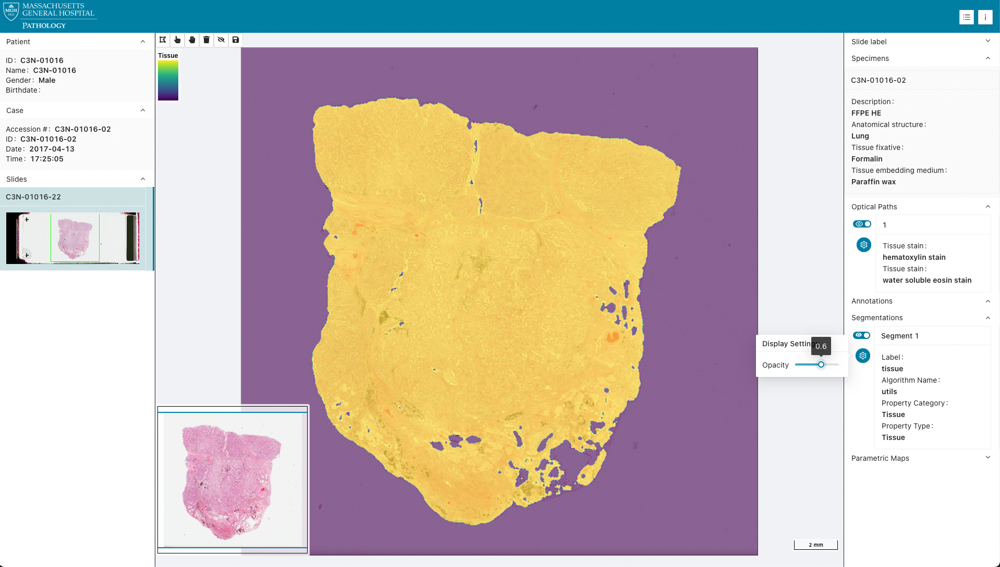
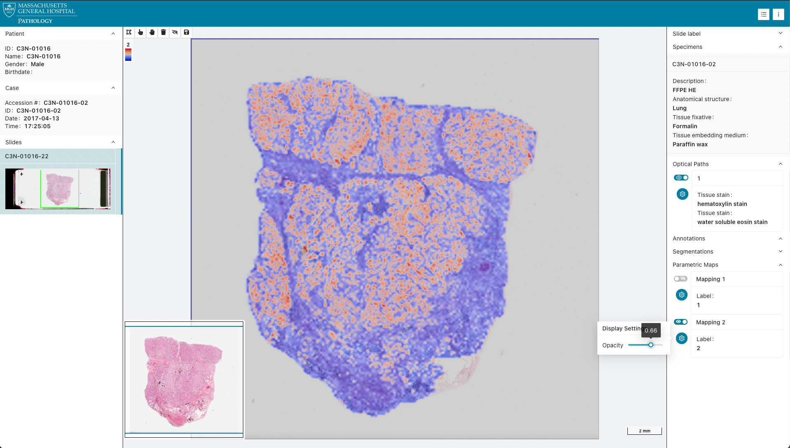

[](https://zenodo.org/badge/latestdoi/335130719)
[](https://github.com/imagingdatacommons/slim/actions)

# Slim: Interoperable slide microscopy viewer and annotation tool for imaging data science and computational pathology

*Slim* is a single-page application for interactive visualization and annotation of digital whole slide microscopy images and derived image analysis results in standard DICOM format.
The application is based on the [dicom-microscopy-viewer](https://github.com/MGHComputationalPathology/dicom-microscopy-viewer) JavaScript library and runs fully client side without any custom server components.
It relies on [DICOMweb](https://www.dicomstandard.org/dicomweb/) RESTful services to search for, retrieve, and store imaging data and can thereby simply be placed in front of any DICOMweb-conformant Image Management System (IMS), Picture Archiving and Communication (PACS), or Vendor Neutral Archive (VNA).

## Explore

### National Cancer Institute's Imaging Data Commons

*Slim* is used as the slide microscopy viewer by the [National Cancer Institute's Imaging Data Commons (IDC)](https://imaging.datacommons.cancer.gov).


Explore public IDC cancer imaging data collections by visiting the IDC web portal: [portal.imaging.datacommons.cancer.gov](https://portal.imaging.datacommons.cancer.gov/).

The IDC viewer uses the [Google Cloud Healthcare API](https://cloud.google.com/healthcare-api/) as DICOMweb server.

### Demo

Below you will find links to the representative DICOM SM images opened in Slim viewer:

* H&E: https://viewer.imaging.datacommons.cancer.gov/slim/studies/2.25.211094631316408413440371843585977094852/series/1.3.6.1.4.1.5962.99.1.208792987.352384958.1640886332827.2.0
* multichannel fluorescence: https://viewer.imaging.datacommons.cancer.gov/slim/studies/2.25.93749216439228361118017742627453453196/series/1.3.6.1.4.1.5962.99.1.2344794501.795090168.1655907236229.4.0?state=1.2.826.0.1.3680043.10.511.3.79630386778396943986328353882008803

## Features

### Display of images

*Slim* enables interactive visualization of [DICOM VL Whole Slide Microscopy Image](https://dicom.nema.org/medical/dicom/current/output/chtml/part03/sect_A.32.8.html) instances in a vendor-neutral and device-independent manner.

Interoperability with various image acquisition and management systems was successfully demonstrated at the [DICOM WG-26 Connectathon at Path Visions 2020](https://digitalpathologyassociation.org/past-presentations#PV20) and the [DICOM WG-26 Hackathon at Path Visions 2021](https://digitalpathologyassociation.org/past-presentations#PV21).
Shown below are screenshots of examples images that are publicly available on the NEMA FTP server at [medical.nema.org](ftp://medical.nema.org).

|     | Vendor | Illumination | Stain |
| :-: |:------ |:------------ | :---  |
|  | Roche Tissue Diagnostics | Brightfield | Trichrome |
|  | 3DHISTECH | Brightfield | H&E |
|  | 3DHISTECH | Fluorescence | DAPI, FITC, Rhodamine |
|  | SamanTree Medical | Fluorescence | Histolog |

### Display of image annotations and analysis results

*Slim* further allows for interative visualization of image annotations and analysis results.
The viewer currently supports the following types of DICOM instances:

Vector graphics:

- [DICOM Comprehensive 3D SR](https://dicom.nema.org/medical/dicom/current/output/chtml/part03/sect_A.35.13.html) instances that are structured according to template [TID 1500 "Measurements Report"](https://dicom.nema.org/medical/dicom/current/output/chtml/part16/chapter_A.html#sect_TID_1500) and contain planar image region of interest (ROI) annotations structured according to template [TID 1410 "Planar ROI Measurements and Qualitative Evaluations"](http://dicom.nema.org/medical/dicom/current/output/chtml/part16/chapter_A.html#sect_TID_1410)
- [DICOM Microscopy Bulk Simple Annotations](https://dicom.nema.org/medical/dicom/current/output/chtml/part03/sect_A.87.html) instances that contain groups of many ROI annotations (e.g., single cells)

Raster graphics:

- [DICOM Segmentation](https://dicom.nema.org/medical/dicom/current/output/chtml/part03/sect_A.51.html) instances that contain binary or fractional segmentation masks
- [DICOM Parametric Map](https://dicom.nema.org/medical/dicom/current/output/chtml/part03/sect_A.75.html) instances that contain saliency maps, attention maps, class activation maps, etc.


|     | DICOM IOD |
| :-: |:--------- |
|  | Segmentation |
|  | Parametric Map |
|  | Comprehensive 3D SR |
|  | Segmentation |
|  | Microscopy Bulk Simple Annotations |

Note that selection of a derived object in the URL will automatically load the referenced slide and will toggle visibility of the selected derived object. 

### Annotation of images

In addition to display, *Slim* provides annotation tools that allow users to create graphical image region of interest (ROI) annotations and store them as [DICOM Comprehensive 3D SR](https://dicom.nema.org/medical/dicom/current/output/chtml/part03/sect_A.35.13.html) instances using SR template [TID 1500 "Measurement Report"](http://dicom.nema.org/medical/dicom/current/output/chtml/part16/chapter_A.html#sect_TID_1500).
ROIs are stored as 3D spatial coordinates (SCOORD3D) in millimeter unit according to SR template [TID 1410 "Planar ROI Measurements and Qualitative Evaluations"](http://dicom.nema.org/medical/dicom/current/output/chtml/part16/chapter_A.html#sect_TID_1410) together with measurements and qualitative evaluations (labels).
Specifically, [Image Region](http://dicom.nema.org/medical/dicom/current/output/chtml/part16/chapter_A.html#para_b68aa0a9-d0b1-475c-9630-fbbd48dc581d) is used to store the vector graphic data and [Finding](http://dicom.nema.org/medical/dicom/current/output/chtml/part16/chapter_A.html#para_c4ac1cac-ee86-4a86-865a-8137ebe1bd95) is used to describe what has been annotated using a standard medical terminology such as [SNOMED CT](https://www.snomed.org/).
The terms that can be chosen by a user can be configured (see [AppConfig.d.ts](src/AppConfig.d.ts)).


## Autentication and authorization

Users can authenticate and authorize the application to access data via [OpenID Connect (OIDC)](https://openid.net/connect/) based on the [OAuth 2.0](https://oauth.net/2/) protocol using either the [authorization code grant type](https://oauth.net/2/grant-types/authorization-code/) (with [Proof Key for Code Exchange (PKCE)](https://oauth.net/2/pkce/) extension) or the legacy [implicit grant type](https://oauth.net/2/grant-types/implicit/).

## Configuration

### Server Configuration

The app can be configured via a `public/config/{name}.js` JavaScript configuration file (see for example the default `public/config/local.js`).
Please refer to the [AppConfig.d.ts](src/AppConfig.d.ts) file for configuration options.

The configuration can be changed at build-time using the `REACT_APP_CONFIG` environment variable.

### Handling Mixed Content and HTTPS

When deploying SLIM with HTTPS, you may encounter mixed content scenarios where your PACS/VNA server returns HTTP URLs in its responses. This commonly occurs when:

- The PACS server populates bulkdataURI fields with internal HTTP URLs
- Your viewer is running on HTTPS but needs to communicate with services that respond with HTTP URLs
- You're using a reverse proxy that terminates SSL

To handle these scenarios, SLIM provides the `upgradeInsecureRequests` option in the server configuration:

```js
window.config = {
  servers: [{
    id: "local",
    url: "https://your-server.com/dcm4chee-arc/aets/MYAET/rs",
    upgradeInsecureRequests: true  // Enable automatic HTTP -> HTTPS upgrade
  }]
}
```

When `upgradeInsecureRequests` is set to `true` and at least one of your URLs (service URL, QIDO, WADO, or STOW prefixes) uses HTTPS, the viewer will automatically:

1. Add the `Content-Security-Policy: upgrade-insecure-requests` header to requests
2. Attempt to upgrade any HTTP responses to HTTPS

This feature was implemented in response to [issue #159](https://github.com/ImagingDataCommons/slim/issues/159) where PACS servers would return HTTP bulkdata URIs even when accessed via HTTPS.

### Messages/Popups Configuration

Configure message popup notifications that appear at the top of the screen. By default, all message popups are enabled.

```javascript
window.config = {
  // ... other config options ...
  messages: {
    disabled: ['warning', 'info'], // Disable specific message types
    duration: 5, // Show messages for 5 seconds
    top: 100 // Show 100px from top of screen
  }
}
```

Options:
- `disabled`: Disable specific message types or all messages
- `duration`: How long messages are shown (in seconds)
- `top`: Distance from top of screen (in pixels)

Available message types:
- `success` - Green popups
- `error` - Red popups  
- `warning` - Yellow popups
- `info` - Blue popups

Examples:
```javascript
// Disable specific types with custom duration and position
messages: {
  disabled: ['warning', 'info'],
  duration: 5, // Show for 5 seconds
  top: 50 // Show 50px from top
}
```

```javascript
// Disable all popups
messages: {
  disabled: true
}
```

Default values if not specified:
- `duration`: 5 seconds
- `top`: 100 pixels

## Deployment

Download the latest release from [github.com/imagingdatacommons/slim/releases](https://github.com/imagingdatacommons/slim/releases) and then run the following commands to install build dependencies and build the app:

```none
yarn install
PUBLIC_URL=/ yarn build
```

Once the app has been built, the content of the `build` folder can be directly served by a static web server at the location specified by `PUBLIC_URL` (in this case at `/`).
The `PUBLIC_URL` must be either a full URL or a relative path to the location at which the viewer application will get deployed (e.g., `PUBLIC_URL=https://imagingdatacommons.github.io/slim` or `PUBLIC_URL='/slim'`).

To learn how to deploy Slim as a Google Firebase webapp, consider [this tutorial](https://tinyurl.com/idc-slim-gcp).

### Local

The repository provides a [Docker compose file](https://docs.docker.com/compose/compose-file/) to deploy a static web server and a [dcm4chee-arc-light](https://github.com/dcm4che/dcm4chee-arc-light) DICOMweb server on localhost for local app development and testing:

```none
docker-compose up -d
```

The local deployment serves the app via an NGINX web server at `http://localhost:8008` and exposes the DICOMweb services at `http://localhost:8008/dcm4chee-arc/aets/DCM4CHEE/rs`.
Once the serives are up, one can store DICOM objects in the archive using the [Store transaction of the DICOMweb Studies Service](http://dicom.nema.org/medical/dicom/current/output/chtml/part18/sect_10.5.html).

The command line interface of the [dicomweb-client Python package](https://dicomweb-client.readthedocs.io/en/latest/usage.html#command-line-interface-cli) makes storing DICOM files in the archive straight forward:

```none
dicomweb_client -vv --url http://localhost:8008/dcm4chee-arc/aets/DCM4CHEE/rs store instances -h
```

The local deployment uses the default configuration file `public/config/local.js`:

```js
window.config = {
  path: "/",
  servers: [
    {
      id: "local",
      url: "http://localhost:8008/dcm4chee-arc/aets/DCM4CHEE/rs",
      write: true
    }
  ],
  annotations: [
    {
      finding: {
        value: '85756007',
        schemeDesignator: 'SCT',
        meaning: 'Tissue'
      },
      style: {
        stroke: {
          color: [251, 134, 4, 1],
          width: 2
        },
        fill: {
          color: [255, 255, 255, 0.2]
        }
      }
    }
  ]
};
```

Customize the configuration according to your needs at either build-time or run-time.

### Google Cloud Platform

*Slim* can be readily configured to connect to a secured DICOMweb endpoint of the [Google Cloud Healthcare API](https://cloud.google.com/healthcare) with OIDC authentication:

```js
const gcpProject = ""
const gcpLocation = ""
const gcpDataset = ""
const gcpStore = ""
const gcpClientID = ""

window.config = {
  path: "/",
  servers: [
    {
      id: "gcp",
      url: `https://healthcare.googleapis.com/v1/projects/${gcpProject}/locations/${gcpLocation}/datasets/${gcpDataset}/dicomStores/${gcpStore}/dicomWeb`,
      write: true
    }
  ],
  oidc: {
    authority: "https://accounts.google.com",
    clientId: gcpClientID,
    scope: "email profile openid https://www.googleapis.com/auth/cloud-healthcare",
    grantType: "implicit",
    endSessionEndpoint: "https://www.google.com/accounts/Logout"
  },
  annotations: [
    {
      finding: {
        value: '108369006',
        schemeDesignator: 'SCT',
        meaning: 'Neoplasm'
      },
      style: {
        stroke: {
          color: [251, 134, 4, 1],
          width: 2
        },
        fill: {
          color: [255, 255, 255, 0.2]
        }
      }
    },
    {
      finding: {
        value: '85756007',
        schemeDesignator: 'SCT',
        meaning: 'Tissue'
      },
      style: {
        stroke: {
          color: [255, 255, 0, 1],
          width: 2
        },
        fill: {
          color: [255, 255, 255, 0.2]
        }
      }
    }
  ]
};
```

#### OAuth 2.0 configuration

Create an [OIDC client ID for web application](https://developers.google.com/identity/sign-in/web/sign-in).

Note that Google's OIDC implementation does currently not yet support the authorization code grant type with PKCE challenge for private clients.
For the time being, the legacy implicit grand type has to be used.

## Development

To install requirements and run the app for local development, run the following commands:

```none
yarn install
yarn start
```

This will serve the app via a development server at [http://localhost:3000](http://localhost:3000) using the default `local` configuration.

The configuration can be specified using the `REACT_APP_CONFIG` environment variable, which can be set either in the `.env` file or directly in the command line:

```none
REACT_APP_CONFIG=local yarn start
```

## Citation

For more information about the motivation, design, and capabilities of Slim, please see the following article:

> [Interoperable slide microscopy viewer and annotation tool for imaging data science and computational pathology](https://doi.org/10.1038/s41467-023-37224-2)
> C. Gorman, D. Punzo, I. Octaviano, S. Pieper, W.J.R. Longabaugh, D.A. Clunie, R. Kikinis, A.Y. Fedorov, M.D. Herrmann
> Nature Communications 4:1572 (2023) https://doi.org/10.1038/s41467-023-37224-2

If you use Slim in your research, please cite the above article.

## DICOM Conformance Statement

The DICOM conformance statement for Slim is available in this repository [here](/DICOM-Conformance-Statement.md)
